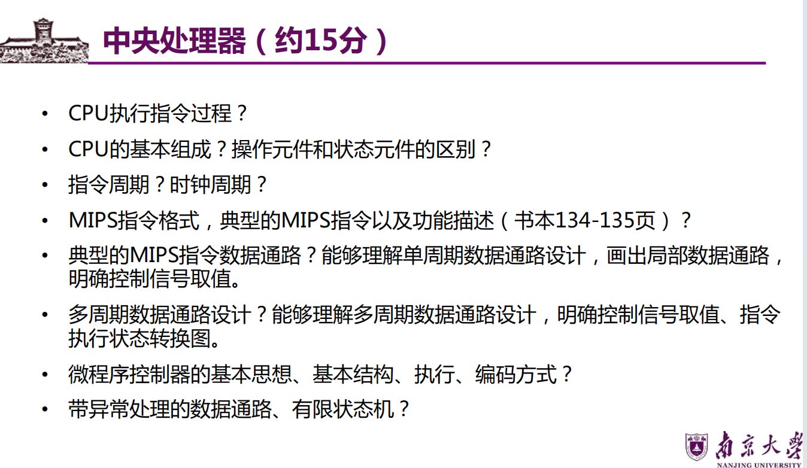

# 第五章 中央处理器（CPU）

## 一、CPU的功能和基本结构
### 1. 核心功能
- 指令控制：按顺序或跳转逻辑取出并执行指令
- 操作控制：控制ALU、寄存器、存储器等部件执行微操作
- 时间控制：同步各部件按时钟周期协调工作
- 数据加工：通过ALU完成算术/逻辑运算
- 异常与中断处理：响应内部异常和外部中断请求

### 2. 基本组成
#### （1）运算器（执行部件）
<!-- 核心功能：完成数据的算术/逻辑运算、数据存储与传输
- 核心部件：算术逻辑单元（ALU）、寄存器组、移位寄存器、暂存寄存器
- 关键寄存器（操作元件 vs 状态元件区别）：
  | 类型       | 寄存器名称                | 功能描述                                                                 |
  |------------|---------------------------|--------------------------------------------------------------------------|
  | 操作元件   | 通用寄存器组（GPRs）      | 存放操作数、地址信息（如AX、BX、CX、DX、SP），指令需指定寄存器编号        |
  | 操作元件   | 累加寄存器（ACC）         | 暂存ALU运算结果                                                         |
  | 操作元件   | 移位寄存器（SR）          | 存放操作数，支持左右移位操作                                             |
  | 操作元件   | 暂存寄存器                | 暂存总线/通用寄存器送来的操作数，供ALU运算（对程序员透明）                 |
  | 状态元件   | 程序状态字寄存器（PSW）   | 保存运算/测试结果的状态信息（OF溢出、SF符号、ZF零、CF进位），每位对应一个触发器 | -->

#### （2）控制器（控制部件）
<!-- 核心功能：生成控制信号，协调各部件按指令要求工作
- 核心部件：指令寄存器（IR）、程序计数器（PC）、地址形成部件、控制逻辑
- 关键寄存器：
  | 寄存器名称                | 功能描述                                                                 | 命题考点                                                                 |
  |---------------------------|--------------------------------------------------------------------------|--------------------------------------------------------------------------|
  | 程序计数器（PC）          | 存放待执行指令的主存地址，按字节编址时位数=主存地址位数；顺序执行时PC+指令字节数，转移时由指令计算新值 | PC位数与主存空间、指令字长的关系（2016、2021）                           |
  | 指令寄存器（IR）          | 保存当前正在执行的指令，位数=指令字长                                     | IR位数与指令字长的关系（2016、2021）                                     |
  | 存储器地址寄存器（MAR）   | 存放主存读写地址，位数=主存地址线数（决定最大寻址单元数）                 | 与MDR的功能区分                                                         |
  | 存储器数据寄存器（MDR）   | 存放主存读写数据，位数=存储字长                                           | 与MAR的功能区分                                                         | -->

## 二、指令执行过程
### 1. 核心周期概念
#### （1）周期定义
- 指令周期：CPU取出并执行一条指令的全部时间（含取指、间址、执行、中断周期）
- 机器周期：指令周期的基本单位（可定长/不定长），对应一次主存访问或ALU运算
- 时钟周期：CPU的最小时间单位（主频的倒数），每个机器周期包含若干时钟周期

#### （2）周期关系（图5.2、5.3）
| 周期类型       | 适用场景                                                                 | 结构示意图                                                                 |
|----------------|--------------------------------------------------------------------------|--------------------------------------------------------------------------|
| 定长机器周期   | 指令执行步骤固定，如无间接寻址的简单指令                                 | 指令周期 = 取指周期 + 执行周期（图5.2(a)）                                |
| 不定长机器周期 | 指令执行步骤可变，如间接寻址指令需增加间址周期                           | 指令周期 = 取指周期 + 间址周期 + 执行周期（图5.2(b)）                      |
| 带中断周期     | 支持中断机制时，指令执行结束后检测中断请求                               | 指令周期 = 取指周期 + 间址周期 + 执行周期 + 中断周期（图5.3）              |

#### （3）关键说明
- 无条件转移指令（JMP）：仅含取指周期+执行周期（无需访存取操作数）
- 间接寻址指令：需增加间址周期（取有效地址）
- 中断周期：进栈操作是SP减1（堆栈向低地址增长），需关中断、保存断点、修改PC为中断服务程序入口

### 2. 指令执行流程（通用步骤）
1. **取指周期**：
- CPU根据PC内容访问主存，取出指令送入IR
- PC自动加1（按指令字节数），或转移时更新为目标地址
1. **间址周期（可选）**：
- 若指令为间接寻址，根据IR中的地址字段访存，取出有效地址
1. **执行周期**：
- 指令译码（IR输出操作码），生成控制信号
- 取操作数（从寄存器或主存），送入ALU
- ALU执行运算，或完成访存、移位等操作
- 保存结果（写入寄存器或主存）
1. **中断周期（可选）**：
- 检测中断请求，若有则关中断、保存断点（PSW、PC）
- PC指向中断服务程序入口，转入中断处理

## 三、MIPS指令格式与功能
### 1. 指令格式（图5.5）
#### （1）R-型指令（寄存器型）
| 31-26 | 25-21 | 20-16 | 15-11 | 10-6 | 5-0 |
|-------|-------|-------|-------|------|-----|
| OP    | rs    | rt    | rd    | shamt| func|
- 功能：寄存器之间的运算（如add、sub、slt）
- 关键字段：OP（操作码，6位，固定为0）、func（功能码，6位，区分具体运算）

#### （2）I-型指令（立即数型）
| 31-26 | 25-21 | 20-16 | 15-0 |
|-------|-------|-------|------|
| OP    | rs    | rt    | imm16|
- 功能：寄存器与立即数运算、访存指令（如ori、addiu、lw、sw、beq）
- 关键字段：imm16（16位立即数，需符号扩展/零扩展）

#### （3）J-型指令（跳转型）
| 31-26 | 25-0 |
|-------|------|
| OP    | target|
- 功能：无条件跳转（如j、jal）
- 关键字段：target（26位目标地址，与PC<31:28>拼接形成32位地址）

### 2. 典型MIPS指令功能（RTL描述）（表5.1）
| 指令                  | 功能描述（RTL）                                  | 说明                                                                 |
|-----------------------|--------------------------------------------------|----------------------------------------------------------------------|
| add rd, rs, rt        | R[rd] ← R[rs] + R[rt]；溢出则异常                | 带符号加法，溢出检测                                                 |
| sub rd, rs, rt        | R[rd] ← R[rs] - R[rt]；溢出则异常                | 带符号减法，溢出检测                                                 |
| subu rd, rs, rt       | R[rd] ← R[rs] - R[rt]                            | 无符号减法，无溢出检测                                               |
| slt rd, rs, rt        | 若R[rs] < R[rt]（带符号），则R[rd]←1，否则←0      | 带符号比较，无溢出检测                                               |
| sltu rd, rs, rt       | 若R[rs] < R[rt]（无符号），则R[rd]←1，否则←0      | 无符号比较，无溢出检测                                               |
| ori rt, rs, imm16     | R[rt] ← R[rs] ∨ ZEXT(imm16)                      | 立即数零扩展，按位或                                                 |
| addiu rt, rs, imm16   | R[rt] ← R[rs] + SEXT(imm16)                      | 立即数符号扩展，加法无溢出检测                                       |
| lw rt, rs, imm16      | Addr ← R[rs] + SEXT(imm16)；R[rt] ← M[Addr]       | 加载指令，访存地址=基址+符号扩展立即数                               |
| sw rt, rs, imm16      | Addr ← R[rs] + SEXT(imm16)；M[Addr] ← R[rt]       | 存储指令，访存地址=基址+符号扩展立即数                               |
| beq rs, rt, imm16     | Cond ← R[rs] - R[rt]；若Cond=0，PC←PC+4+SEXT(imm16)×4 | 相等则跳转，相对寻址，位移量×4（字对齐）                             |
| j target              | PC ← (PC<31:28> ∥ target<25:0> ∥ 00)              | 绝对跳转，地址拼接（PC高4位+target+低2位00）                         |

## 四、数据通路的功能和基本结构
### 1. 单周期数据通路（图5.16）
#### （1）核心特点
- 一条指令在一个时钟周期内完成，所有部件并行工作
- 时钟周期=最长指令的执行时间（如lw指令，需访存+ALU运算）

#### （2）关键部件与控制信号
| 部件               | 功能描述                                                                 | 控制信号（加粗为核心信号）                                             |
|--------------------|--------------------------------------------------------------------------|--------------------------------------------------------------------------|
| 寄存器堆（Registers） | 存放通用寄存器，支持读写操作                                             | **RegWr**（写使能：1=写）、**RegDst**（目的寄存器选择：1=Rd，0=Rt）     |
| ALU                | 执行算术/逻辑运算                                                       | **ALUctr**（运算类型）、**ALUSrc**（B口来源：1=扩展器，0=寄存器）        |
| 扩展器             | 处理16位立即数（符号扩展/零扩展）                                       | **ExtOp**（扩展方式：1=符号扩展，0=零扩展）                              |
| 数据存储器（Mem）  | 存放数据，支持读写操作                                                   | **MemWr**（写使能：1=写）、**MemtoReg**（写回来源：1=Mem，0=ALU）        |
| 取指部件           | 从主存取出指令，更新PC                                                   | **Branch**（分支使能）、**Jump**（跳转使能）                            |

#### （3）数据流向
- 取指：PC→存储器→IR（指令），PC自动+4
- 译码：IR输出rs、rt、rd→寄存器堆→busA、busB
- 执行：busA/扩展器输出→ALU→运算结果
- 写回：ALU结果/Mem数据→寄存器堆/主存

### 2. 多周期数据通路（图5.25）
#### （1）核心特点
- 一条指令分为多个时钟周期完成，每个周期完成一个微操作
- 时钟周期=最短微操作的时间，指令周期=多个时钟周期之和（按需分配）

#### （2）新增控制信号
- **PCWr**（PC写使能）、**PCWrCond**（条件写PC：分支跳转时有效）
- **IRWr**（IR写使能：取指时置1）、**IorD**（访存地址选择：1=ALU结果，0=PC）
- **PCSource**（PC来源选择：分支目标/跳转目标/PC+4）
- **BrWr**（分支条件写使能）

#### （3）状态转换
- 每个时钟周期对应一个状态（如取指、译码、执行、访存、写回）
- 状态转换由控制逻辑根据指令类型和运算结果决定（如beq指令需判断Zero信号）

## 五、控制器的功能和工作原理
### 1. 微程序控制器
#### （1）基本思想
- 将每条机器指令转化为一段**微程序**（微指令的有序集合）
- 微指令产生控制信号，控制部件执行微操作，实现指令功能
- 本质：用软件方法设计硬件控制逻辑（微程序=硬件的“软件”）

#### （2）核心概念（表5.2）
| 概念               | 定义与说明                                                                 | 命题考点                                                                 |
|--------------------|--------------------------------------------------------------------------|--------------------------------------------------------------------------|
| 微命令             | 控制部件发出的最小控制信号（如RegWr、MemWr），与微操作一一对应             | 相容性（可同时出现）、互斥性（不可同时出现）                               |
| 微指令             | 若干微命令的集合，含**操作控制字段**（微命令）和**顺序控制字段**（下条微地址） | 微指令字长=操作控制字段位数+顺序控制字段位数                               |
| 微周期             | 取出并执行一条微指令的时间（=时钟周期）                                   | 与指令周期的关系：指令周期=微周期×微指令条数                               |
| 控制存储器（CM）   | 存放微程序，CPU内部ROM实现                                               | 与主存的区别（2017）：主存存程序/数据（外部RAM），CM存微程序（内部ROM）   |
| 微程序             | 实现一条机器指令的微指令序列                                             | 与程序的区别：程序是指令集合（用户编写），微程序是微指令集合（设计者编写，透明） |

#### （3）基本结构（图5.11）
- 核心部件：控制存储器（CM）、微指令寄存器（μIR）、微地址形成部件、微程序计数器（μPC）
- 工作流程：
  1. 取指微程序：μPC→CM→μIR→取指微操作（PC→主存→IR）
  2. 指令译码：IR的OP字段→微地址形成部件→微程序入口地址
  3. 执行微程序：逐条取出微指令→产生控制信号→执行微操作
  4. 循环：一条指令执行完后，返回取指微程序入口

#### （4）微指令编码方式
| 编码类型       | 格式（图5.14、5.15）                          | 优点                                  | 缺点                                  |
|----------------|-----------------------------------------------|---------------------------------------|---------------------------------------|
| 水平型微指令   | 操作控制字段（多位，1位对应1个微命令）+顺序控制字段 | 并行能力强、微程序短、执行速度快      | 微指令长、编写复杂                    |
| 垂直型微指令   | 微操作码（OP）+源地址+目的地址                | 微指令短、规整、编写简单              | 并行能力弱、微程序长、执行速度慢      |

### 2. 硬布线控制器（对比）
- 基本思想：用组合逻辑电路（与或非门）直接产生控制信号
- 特点：速度快（无微程序查表延迟）、设计复杂（需手工优化）、灵活性差（修改需改硬件）
- 与微程序控制器对比：硬布线适合RISC（指令少、规整），微程序适合CISC（指令多、复杂）

## 六、异常和中断机制
### 1. 基本概念
| 类型       | 定义与触发源                                 | 核心区别                                                                 |
|------------|----------------------------------------------|--------------------------------------------------------------------------|
| 异常（内中断） | CPU内部产生的同步事件（与当前指令相关）       | 检测由CPU自身完成，如溢出、缺页、非法指令                                 |
| 中断（外中断） | 外部设备产生的异步事件（与当前指令无关）     | 需通过中断请求线（INTR/NMI）通知CPU，如键盘输入、打印机缺纸               |

### 2. 分类
#### （1）异常分类（表5.3）
| 类型       | 定义与示例                                                                 | 断点处理                                                                 |
|------------|--------------------------------------------------------------------------|--------------------------------------------------------------------------|
| 故障（Fault） | 指令执行中检测到的可恢复事件（如缺页、除数为0、非法操作码）                 | 可恢复（如缺页）→ 返回故障指令重新执行；不可恢复（如除数为0）→ 终止进程   |
| 自陷（Trap）  | 预先安排的事件（如断点、系统调用、单步跟踪）                               | 执行完自陷指令后，返回下一条指令（转移指令返回目标指令）                   |
| 终止（Abort） | 硬件故障（如存储器校验错、总线错误），无法继续执行                         | 终止进程，重启系统                                                       |

#### （2）中断分类
| 类型               | 触发方式                                 | 处理优先级                                 |
|--------------------|------------------------------------------|------------------------------------------|
| 可屏蔽中断（INTR） | 外部设备通过INTR线请求，可通过屏蔽字关闭 | 低（如打印机中断）                       |
| 不可屏蔽中断（NMI） | 紧急硬件故障（如电源掉电），不可屏蔽     | 高（必须立即处理）                       |

### 3. 处理过程
1. 检测请求：CPU在指令执行结束后（中断）或执行中（异常）检测请求
2. 响应请求：关中断（避免嵌套）、保存断点（PC、PSW）
3. 转入处理：PC指向异常/中断服务程序入口
4. 执行服务程序：处理故障（如缺页调页）、完成I/O操作等
5. 恢复返回：恢复断点（PC、PSW）、开中断、返回原程序

## 七、指令流水线（第六章先导）
### 1. 基本概念
- 核心思想：将指令执行过程拆分为多个独立功能段，多指令重叠执行（类似工厂流水线）
- 优点：提高指令吞吐率（单位时间执行的指令数），降低CPI（平均每条指令的时钟周期数）

### 2. 多处理器基本概念
| 类型               | 定义与示例                                                                 |
|--------------------|--------------------------------------------------------------------------|
| SISD（单指令流单数据流） | 单CPU执行一条指令，处理一个数据（如早期单片机）                             |
| SIMD（单指令流多数据流） | 单CPU执行一条指令，处理多个数据（如向量处理器、GPU）                       |
| MIMD（多指令流多数据流） | 多CPU并行执行多条指令，处理多个数据（如多核处理器、服务器集群）             |
| 多核处理器（Multi-core） | 单芯片集成多个独立CPU核心，共享L2/L3 Cache，支持并行执行                   |
| 共享内存多处理器（SMP） | 多个CPU核心共享主存，通过总线通信（如桌面多核CPU）                         |
| 硬件多线程         | 单个CPU核心支持多个线程并行执行（如超线程技术，HT）                         |

## 八、第五章核心考点汇总
1. **基本概念类**：CPU组成（运算器/控制器寄存器）、指令周期/机器周期/时钟周期的关系、异常与中断的区别
2. **原理与计算类**：MIPS指令格式与地址转换、单/多周期数据通路的控制信号取值、微程序控制器的工作流程
3. **设计与对比类**：硬布线与微程序控制器的区别、水平型与垂直型微指令的对比、异常/中断的分类与处理
4. **命题高频点**：PC/IR的位数关系、主存与控制存储器的区别、自陷的性质、异常响应时机

---

