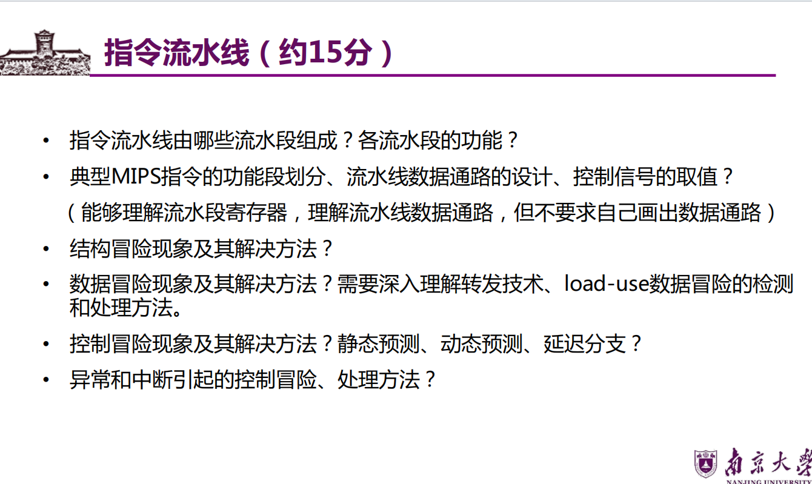

# 第六章 指令流水线

## 一、指令流水线的基本概念
### 1. 核心定义
- 流水线：将指令执行过程拆分为**k个独立功能段**，每个段在一个时钟周期内完成特定操作，多指令重叠执行
- 流水线吞吐率（TP）：单位时间内完成的指令数（核心性能指标）
- 流水线加速比（S）：不使用流水线与使用流水线的执行时间之比
- 流水线效率（E）：流水线实际利用率（=加速比/段数k）

### 2. 5段流水线经典结构
| 功能段       | 英文缩写 | 功能描述                                                                 |
|--------------|----------|--------------------------------------------------------------------------|
| 取指令       | IF       | 从主存取出指令，PC+4                                                     |
| 指令译码     | ID       | 解析指令操作码，取操作数（寄存器堆读），生成控制信号                       |
| 执行运算     | EX       | ALU执行算术/逻辑运算，计算访存地址（lw/sw指令）                           |
| 存储器访问   | MEM      | 读写数据存储器（lw=读，sw=写，R-型指令无操作）                           |
| 写回寄存器   | WB       | 将运算结果/访存数据写回通用寄存器（sw指令无操作）                         |

## 二、指令流水线的功能段划分（MIPS指令）
### 1. R-型指令（如add、sub、slt）（图6.2）
- 功能段：IF → ID → EX → WB（无MEM段，无需访存）
- 关键操作：EX段完成ALU运算，WB段写回寄存器（需溢出检测）

### 2. I-型运算类指令（如addiu、ori）
- 功能段：IF → ID → EX → WB（与R-型一致）
- 关键操作：ID段对imm16扩展，EX段完成ALU运算

### 3. lw指令（加载指令）（图6.3）
- 功能段：IF → ID → EX → MEM → WB（需访存+写回）
- 关键操作：EX段计算访存地址（基址+符号扩展立即数），MEM段读数据存储器，WB段写回寄存器

### 4. sw指令（存储指令）（图6.4）
- 功能段：IF → ID → EX → MEM（无WB段，无需写回寄存器）
- 关键操作：EX段计算访存地址，MEM段写数据存储器

### 5. beq指令（分支指令）（图6.4）
- 功能段：IF → ID → EX → MEM（无WB段，需更新PC）
- 关键操作：EX段比较rs/rt（减法运算），MEM段更新PC为分支目标地址

## 三、流水线数据通路基本框架（图6.5）
### 1. 核心部件与流水段寄存器

- 流水段寄存器：IF/ID、ID/EX、EX/MEM、MEM/WB（存放前一段的结果，同步数据传输）
- 关键控制信号（延续单周期数据通路，新增流水线专用信号）：

  | 功能段 | 控制信号                                                                 |
  |--------|--------------------------------------------------------------------------|
  | ID     | ExtOp（立即数扩展）、RegDst（目的寄存器选择）                            |
  | EX     | ALUop（ALU运算类型）、ALUSrc（B口来源）                                  |
  | MEM    | MemWr（存储器写使能）、Branch（分支使能）、Jump（跳转使能）                |
  | WB     | MemtoReg（写回来源）、RegWr（寄存器写使能）                              |

### 2. 关键说明
- 流水段寄存器无写使能信号：每个时钟周期自动写入前一段数据
- 前两个段（IF、ID）为公共功能段，所有指令共用
- 控制信号与指令同步传输：IF/ID寄存器传递指令，ID/EX寄存器传递控制信号

## 四、流水线冒险及其处理
### 1. 结构冒险（资源冲突）
#### （1）定义
- 不同指令在同一时钟周期争用同一功能部件（如指令和数据共用主存，lw指令MEM段与后续指令IF段访存冲突）

#### （2）解决方法
| 方法               | 原理与示例                                                                 |
|--------------------|--------------------------------------------------------------------------|
| 暂停后续指令       | 前一条指令访存时，后续指令停顿1个时钟周期（表5.3）                         |
| 分离功能部件       | 独立设置指令存储器（I-Cache）和数据存储器（D-Cache），避免访存冲突（主流方案） |
| 多端口寄存器堆     | 寄存器堆设置多个读口/写口，避免读写冲突                                   |

### 2. 数据冒险（数据相关）
#### （1）定义
- 后续指令需使用前面指令的结果，但前面指令尚未完成写回（仅存在RAW冲突：写后读，按序执行流水线）
- 示例：I1 add R1,R2,R3（写R1）→ I2 sub R4,R1,R5（读R1），I2 ID段读R1时，I1尚未WB段写R1

#### （2）解决方法
| 方法               | 原理与示例                                                                 | 适用场景                                   |
|--------------------|--------------------------------------------------------------------------|------------------------------------------|
| 硬件阻塞（Stall）  | 暂停后续指令1-2个时钟周期，直到前面指令写回（表5.5）                       | 所有数据冒险，简单但降低吞吐率             |
| 转发（旁路）技术   | 不等待写回寄存器，直接将中间结果（EX/MEM寄存器）转发到ALU输入端（表5.6）   | 相邻指令数据相关（如R-型→R-型）           |
| 软件插入NOP指令    | 编译器在相关指令间插入空操作，填充等待周期                                 | 无法通过转发解决的冲突（如load-use）       |
| load-use冒险处理   | lw指令与后续运算指令相关时，插入1条NOP（表5.7），或编译器重排指令顺序       | lw→运算指令（如lw R2,0(R1)→add R3,R2,R4） |

### 3. 控制冒险（分支冲突）
#### （1）定义
- 分支指令（如beq）改变指令执行顺序，导致流水线断流（需等待分支结果才能确定下一条指令地址）

#### （2）解决方法
| 方法               | 原理与示例                                                                 | 优点                                  | 缺点                                  |
|--------------------|--------------------------------------------------------------------------|---------------------------------------|---------------------------------------|
| 插入NOP指令        | 分支指令后插入3条NOP（延迟损失时间片C=3），等待分支结果（表5.8）           | 简单易实现                            | 吞吐率下降明显                        |
| 分支预测           | 静态预测（如预测不跳转）、动态预测（BHT分支历史表，表6.20）                 | 预测准确率高（动态预测>90%）          | 硬件复杂                              |
| 延迟分支（Delayed Branch） | 编译器重排指令，将分支前无关指令填入分支延迟槽（表6.24）                   | 无需阻塞，提升吞吐率                  | 依赖编译器优化                        |
| 提前计算分支地址   | 在ID段计算分支目标地址，EX段判断分支条件，减少延迟                         | 缩短延迟损失时间片                    | 需额外硬件支持                        |

## 五、流水线的性能指标
### 1. 吞吐率（TP）
#### （1）公式

\[ TP = \frac{n}{T_A} \]

- \(n\)：指令数；\(T_A\)：执行n条指令的总时间
- 理想情况（连续输入指令）：\(T_A = (k + n - 1) \Delta t\)（\(k\)：段数，\(\Delta t\)：时钟周期）
\[ TP = \frac{n}{(k + n - 1) \Delta t} \]
- 最大吞吐率（\(n \to \infty\)）：\(TP_{max} = \frac{1}{\Delta t}\)（每个时钟周期完成1条指令）

### 2. 加速比（S）
#### （1）公式

\[ S = \frac{T_0}{T_k} \]

- \(T_0\)：顺序执行时间（\(T_0 = k \cdot n \cdot \Delta t\)）；\(T_k\)：流水线执行时间
\[ S = \frac{k \cdot n}{k + n - 1} \]
- 最大加速比（\(n \to \infty\)）：\(S_{max} = k\)（加速比≤段数）

### 3. 效率（E）

\[ E = \frac{S}{k} = \frac{n}{k + n - 1} \]

- 理想情况（\(n \to \infty\)）：\(E_{max} = 1\)（流水线100%利用）

## 六、高级流水线技术
### 1. 超标量流水线
#### （1）核心特点
- 动态多发射技术：每个时钟周期发射≥2条独立指令（如2发射、4发射）
- 需配置多个功能部件（ALU、寄存器堆多端口、多Cache）
- 指令可乱序执行（结合动态分支预测、寄存器重命名）

#### （2）性能指标
- CPI < 1（如2发射流水线，理想CPI=0.5）
- 吞吐率=发射宽度×基础吞吐率（如2发射，\(TP_{max} = \frac{2}{\Delta t}\)）

### 2. 超长指令字（VLIW）技术
#### （1）核心特点
- 静态多发射技术：编译器将多条并行指令组合成一条超长指令（数百位）
- 硬件简单（无动态调度逻辑），依赖编译器优化（挖掘指令级并行）
- 缺点：指令长度固定，灵活性差，兼容性差

### 3. 超流水线技术
#### （1）核心特点
- 细分功能段（如将5段拆分为10段），缩短时钟周期（\(\Delta t\)减小）
- 每个时钟周期仍发射1条指令，CPI=1，但主频更高
- 缺点：流水段寄存器开销增大，分支延迟损失更明显

### 4. 三种技术对比
| 技术类型       | 发射方式 | CPI   | 硬件复杂度 | 依赖优化               |
|----------------|----------|-------|------------|------------------------|
| 超标量         | 动态多发射 | <1    | 高         | 硬件动态调度           |
| 超长指令字     | 静态多发射 | <1    | 低         | 编译器静态调度         |
| 超流水线       | 单发射     | =1    | 中         | 功能段细分             |

## 七、第六章核心考点汇总
1. **基本概念类**：流水线功能段划分、流水段寄存器的作用、三种冒险的定义
2. **原理与计算类**：流水线吞吐率/加速比计算、最大吞吐率/加速比推导
3. **设计与处理类**：三种冒险的解决方法（尤其是转发技术、分支预测、延迟分支）
4. **命题高频点**：数据冒险的RAW冲突、结构冒险的访存冲突解决、超标量流水线的CPI特性