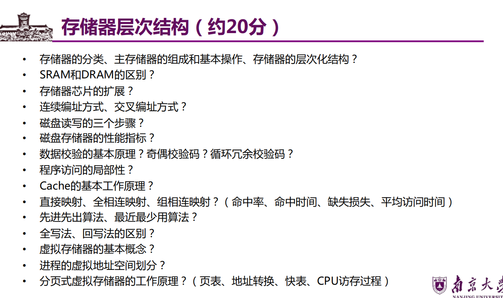

# 第七章 存储系统

## 一、存储器分类
### 1. 核心分类维度
- 按存储介质：半导体存储器（SRAM、DRAM、Flash）、磁表面存储器（磁盘）、光存储器（光盘）
- 按存取方式：随机存取存储器（RAM）、只读存储器（ROM）、顺序存取存储器（磁带）、直接存取存储器（磁盘）
- 按易失性：易失性存储器（SRAM、DRAM）、非易失性存储器（ROM、Flash、磁盘、光盘）
- 按层次结构：寄存器、Cache、主存、辅存（磁盘、磁带、光盘）

### 2. 关键类别定义
- 随机存储器（RAM）：可随机读写，断电后信息丢失，分为静态SRAM和动态DRAM
- 只读存储器（ROM）：断电后信息不丢失，正常工作时只能读出，用于存储固件、BIOS等
- Flash存储器：非易失性，兼具SRAM的高速和DRAM的大容量，用于U盘、固态硬盘（SSD）

## 二、存储器的组成和基本操作
### 1. 核心组成部件
- **MAR（存储器地址寄存器）**：存放CPU要访问的存储器地址
- **MDR（存储器数据寄存器）**：存放CPU与存储器之间传输的数据
- 存储体（存储矩阵）：存储单元的集合，由行选择线（X）和列选择线（Y）选择访问单元
- 地址译码器：将地址转换为译码输出线上的高电平，分单译码法（一维）和双译码法（二维，DRAM常用）
- I/O控制电路：控制读出/写入，放大信息
- 控制信号：片选信号（CS，选中目标芯片）、读/写控制信号（WE，控制读写操作）

### 2. 核心概念与性能指标
#### （1）编址方式
- 字节编址：以字节为基本存储单元（主流方式）
- 字编址：以字为基本存储单元（需明确字长）

#### （2）存储速度相关
- 存取时间（Ta）：从启动存储器操作到完成操作的时间（分读出时间、写入时间）
- 存取周期（Tm）：连续两次独立访问存储器的最小时间间隔（Tm = Ta + 恢复时间；破坏性读出存储器可能Tm = 2Ta）
- 主存带宽（Bm）：每秒从主存进出的最大信息数量，单位：字/秒、B/s、b/s  
  公式：数据传输速率 = 数据宽度 × 存取周期倒数

#### （3）地址空间
- 最大地址范围：由地址线位数决定（n位地址线对应2ⁿ个存储单元）
- 地址空间大小：存储单元最大值（即2ⁿ，n为地址线位数）

### 3. 基本操作流程
- 读操作：CPU送地址到MAR → 地址译码选中存储单元 → 存储单元数据读出到MDR → CPU从MDR取数据
- 写操作：CPU送地址到MAR、数据到MDR → 地址译码选中存储单元 → MDR数据写入存储单元

## 三、层次化存储结构
### 1. 核心原理
利用程序访问的局部性，通过不同速度、容量、价格的存储器层级配合，平衡速度与成本，实现“高速缓存-主存-辅存”三级结构。

### 2. 层级结构对比（图3.2 多级存储器结构）
| 层级       | 速度   | 容量   | 价格   | 核心器件       |
|------------|--------|--------|--------|----------------|
| CPU寄存器  | 最快   | 最小   | 最高   | 寄存器阵列     |
| 高速缓存（Cache） | 很快 | 较小 | 较高 | SRAM           |
| 主存       | 中等   | 中等   | 中等   | DRAM           |
| 磁盘       | 较慢   | 较大   | 较低   | 磁表面存储     |
| 磁带/光盘  | 最慢   | 最大   | 最低   | 磁/光存储      |

### 3. 三级存储系统构成（图3.3）
- Cache-主存层：解决CPU与主存速度不匹配问题（硬件管理）
- 主存-辅存层：解决主存容量不足问题（操作系统+硬件管理，即虚拟存储器）

## 四、半导体随机存储器（SRAM & DRAM）
### 1. 核心区别（表3.1）
| 特点         | SRAM（静态随机存储器） | DRAM（动态随机存储器） |
|--------------|------------------------|------------------------|
| 存储信息     | 双稳态触发器（6晶体管MOS） | 电容电荷               |
| 破坏性读出   | 非                     | 是                     |
| 需要刷新     | 不需要                 | 需要（定时刷新+读后再生） |
| 地址传输方式 | 行列地址同时送         | 行列地址分两次送（复用） |
| 运行速度     | 快                     | 慢                     |
| 集成度       | 低                     | 高                     |
| 存储成本     | 高                     | 低                     |
| 主要用途     | 高速缓存（Cache）      | 主存储器（内存）       |

### 2. 工作原理补充
- **SRAM**：存储元为双稳态触发器，读出后状态不变（非破坏性读出），无需刷新，存取速度快但功耗高、集成度低。
- **DRAM**：存储元仅1个晶体管+电容，电容电荷会泄露，需每1~2ms刷新一次（常用集中式、分散式、异步式刷新），集成度高、成本低，是主存的核心器件。

### 3. DDR（Double Data Rate）
双倍数据速率同步DRAM，在时钟上升沿和下降沿均传输数据，提升数据传输速率，常见DDR4、DDR5等规格。

## 五、主存储器
### 1. DRAM芯片与内存条
- DRAM芯片：采用二维译码结构（X+Y译码），地址线复用（行列地址分两次输入）
- 内存条：多个DRAM芯片通过位扩展、字扩展组成，常见容量（8GB、16GB）、位宽（64位）

### 2. 存储器芯片扩展
#### （1）扩展方式
- 位扩展：增加存储字长（如8片8位DRAM芯片扩展为64位）
- 字扩展：增加存储单元数量（如2片1GB芯片扩展为2GB）
- 字位同时扩展：既增加字长又增加容量

#### （2）扩展示意图（图7.10）
主存储器地址A处的64位数据由8片DRAM芯片（每片8位）通过位扩展实现，地址线分为行地址（4096行）和列地址（4096列），芯片选择通过片选信号（CS）控制。

### 3. 多模块存储器
#### （1）连续编址（图7.12）
- 地址结构：体号（高位）+ 体内地址（低位）
- 特点：同一模块连续访问，模块间并行性差，地址0~n-1属M0，n~2n-1属M1，依此类推。

#### （2）交叉编址（图7.13）
- 地址结构：体内地址（高位）+ 体号（低位）
- 特点：不同模块交替访问，并行性高，地址0属M0、1属M1、2属M2、3属M3，依此类推，可实现流水线访问。

#### （3）核心区别
| 编址方式 | 地址分配逻辑       | 访问效率       | 适用场景       |
|----------|--------------------|----------------|----------------|
| 连续编址 | 高位为体号         | 低（串行访问） | 小容量主存     |
| 交叉编址 | 低位为体号         | 高（并行访问） | 大容量主存     |

### 4. 主存与CPU的连接
- 地址线：CPU地址总线直接连接主存MAR，地址线位数决定主存最大容量
- 数据线：CPU数据总线连接主存MDR，数据总线宽度决定一次传输的数据量（如64位）
- 控制线：CPU的读（RD）、写（WR）信号控制主存读写操作，片选信号（CS）选中目标存储模块

## 六、外部存储器
### 1. 磁盘存储器
#### （1）组成（图3.14）
- 盘片：存储数据的载体，含多个记录面
- 磁头：每个记录面对应一个磁头，用于读写数据
- 磁盘驱动器：驱动盘片旋转（转速r转/秒），控制磁头移动
- 磁盘控制器：主机与磁盘驱动器的接口，解释CPU命令、传输数据

#### （2）存储区域划分
- 磁道：每个记录面上的同心圆轨道
- 柱面：不同记录面的相同编号磁道构成的圆柱面（磁头移动时同步移动）
- 扇区：磁道上的弧形区域，是磁盘读写的最小单位（通常512B或4KB）
- 间隙：相邻磁道/扇区间的隔离区域，避免精度错误

#### （3）核心参数
- 磁头数（Heads）：记录面数
- 柱面数（Cylinders）：每面磁道数
- 扇区数（Sectors）：每道扇区数

#### （4）性能指标
- 记录密度：道密度（沿半径单位长度磁道数）、位密度（磁道单位长度二进制位数）、面密度（道密度×位密度）
- 存储容量：
  - 非格式化容量 = 记录面数 × 柱面数 × 每道磁化单元数
  - 格式化容量 = 记录面数 × 柱面数 × 每道扇区数 × 每扇区容量（实际可用容量，小于非格式化容量）
- 存取时间 = 平均寻道时间 + 平均旋转延迟时间 + 传输时间
  - 平均寻道时间：磁头从最外道到最内道时间的一半
  - 平均旋转延迟时间：盘片旋转半周的时间（1/(2r)，r为转速）
  - 传输时间：数据传输所需时间（扇区数×每扇区容量 / 数据传输速率）
- 数据传输速率（D）：D = r × N（r为转速，N为每道容量）

#### （5）读写三步流程（图3.14）
1. 寻道：磁头移动到目标磁道（寻道时间）
2. 旋转延迟：目标扇区旋转到磁头下方（旋转延迟时间）
3. 读写：磁头读写扇区数据（传输时间）

### 2. 固态硬盘（SSD）
- 核心器件：Flash存储器
- 优点：读写速度快、无机械部件（抗震、低功耗）
- 缺点：寿命有限（写入次数限制）、成本高于磁盘

### 3. 磁盘高速缓存（Disk Cache）
- 定义：内存中开辟的缓冲区，用于缓冲磁盘读写数据
- 优点：按“簇”写盘，避免频繁小块数据写盘；中间结果可快速复用，提升磁盘I/O效率

## 七、数据校验
### 1. 核心原理
基于“冗余校验”：在有效数据中增加冗余位，通过冗余位与有效位的逻辑关系，检测或纠正数据传输/存储中的错误。

### 2. 奇偶校验码
#### （1）奇校验
- 规则：有效数据位（M）中1的个数为奇数时，冗余位（P）取0；否则取1，确保整体1的个数为奇数。
- 示例：M=1010（1的个数=2，偶数）→ P=1 → 校验码=10101

#### （2）偶校验
- 规则：有效数据位中1的个数为偶数时，P取0；否则取1，确保整体1的个数为偶数。
- 示例：M=1010（1的个数=2，偶数）→ P=0 → 校验码=10100
- 特点：只能检测1位错误，无法纠正错误。

### 3. 循环冗余校验码（CRC）
#### （1）核心原理
- 将有效数据视为二进制多项式M(x)，乘以xᵏ（k为冗余位位数），再除以生成多项式G(x)，余数即为冗余位（CRC码）。
- 接收端：将接收到的校验码除以G(x)，余数为0则无错误，否则有错误。

#### （2）示例（k=3）
- 设M(x)=1010（x³+x），G(x)=1011（x³+x+1）
- M(x)×x³=1010000
- 1010000 ÷ 1011，余数=011 → CRC码=1010000+011=1010011
- 特点：检错能力强，可检测出所有单错、双错、奇数错及大部分突发错，广泛用于磁盘存储、网络传输。

## 八、程序访问的局部性
### 1. 核心定义
程序执行时，对存储器的访问存在局部集中的特性，分为时间局部性和空间局部性。

### 2. 分类及示例
#### （1）时间局部性
- 定义：最近使用过的信息，未来大概率再次使用。
- 示例：循环语句、子程序重复调用、数组重复访问。

#### （2）空间局部性
- 定义：最近使用过的信息，其邻近地址的信息未来大概率使用。
- 示例：指令顺序执行（顺序存储）、数组连续存储与访问。

### 3. 应用价值
高速缓冲存储器（Cache）、虚拟存储器的设计核心均基于局部性原理，通过将近期可能访问的数据/指令放入高速存储层级，提升访问效率。

## 九、高速缓冲存储器（Cache）
### 1. 基本原理
- 位于CPU与主存之间，由SRAM构成，容量小、速度快。
- 工作流程：
  1. CPU发读请求→检查地址是否在Cache中（命中判断）。
  2. 命中（概率p，命中率）：直接从Cache读取，耗时Tc（命中时间）。
  3. 不命中（概率1-p，缺失率）：从主存读取该块数据（耗时Tm，缺失损失），存入Cache（若Cache满则替换旧块），同时将数据送CPU。
- 数据交换单位：CPU与Cache以“字”为单位，Cache与主存以“Cache块”为单位（块大小通常为2ⁿ字节）。

### 2. 平均访问时间公式

\[ T_a = p \times T_c + (1-p) \times (T_c + T_m) = T_c + (1-p) \times T_m \]

- 因p≈1（命中率接近1），Ta≈Tc，大幅提升访存速度。

### 3. Cache与主存的映射方式
#### （1）直接映射（图3.18）
- 映射关系：Cache行号 = 主存块号 mod Cache总行数（设Cache有2ᶜ行，主存有2ᵐ块）
- 地址结构：标记（t=m-c位） + Cache行号（c位） + 块内地址（b位）
- 访存过程：
  1. 由地址中间c位找到Cache行。
  2. 比较Cache行标记与地址高t位，且有效位为1→命中，按块内地址存取。
  3. 不命中→从主存调块到该Cache行，置有效位为1，更新标记。
- 优点：实现简单、命中时间短；缺点：块冲突概率高（多个主存块映射到同一Cache行）。

#### （2）全相联映射（图3.19）
- 映射关系：主存块可装入Cache任意行。
- 地址结构：标记（t=log₂主存块数） + 块内地址（b位）
- 访存过程：
  1. 地址高t位与所有Cache行标记比较，且有效位为1→命中。
  2. 不命中→调块到任意空闲Cache行，置有效位、更新标记。
- 优点：块冲突概率低、命中率高；缺点：标记比较复杂（需相联存储器）、实现成本高、命中时间长。

#### （3）组相联映射（图3.20）
- 映射关系：Cache分Q组，主存块号 mod Q = Cache组号（组间直接映射，组内全相联映射）
- 地址结构：标记（t位） + Cache组号（q位，Q=2ᵠ） + 块内地址（b位）
- 分类：每组r行→r路组相联（如r=2→二路组相联）
  - r=1→全相联映射；r=Cache总行数→直接映射。
- 访存过程：
  1. 由地址q位找到Cache组。
  2. 地址高t位与该组所有行标记比较，有效位为1→命中。
  3. 不命中→调块到该组任意空闲行，置有效位、更新标记。
- 优点：平衡直接映射（低成本）和全相联（高命中率），是主流映射方式。

### 4. Cache块替换算法
#### （1）先进先出算法（FIFO）
- 规则：替换最早调入Cache的块。
- 优点：实现简单（用计数器记录调入顺序）；缺点：未考虑块的使用频率，可能替换常用块（Belady异常）。

#### （2）最近最少使用算法（LRU）
- 规则：替换最近一段时间内使用次数最少的块。
- 优点：符合局部性原理，命中率高于FIFO；缺点：实现复杂（需记录块的使用时序，如栈、计数器）。

#### （3）其他算法
- 最不经常使用（LFU）：替换总使用次数最少的块；
- 随机替换（RAND）：随机替换块，实现简单，命中率略低于LRU。

### 5. Cache写策略
#### （1）全写法（Write-Through）
- 规则：CPU写Cache时，同时写主存，确保Cache与主存数据一致。
- 优点：实现简单、数据一致性好；缺点：写操作延迟大（需等待主存写入完成）、占用主存带宽。
- 优化：增加写缓冲（Write Buffer），CPU写Cache后先写入缓冲，缓冲再异步写主存。

#### （2）回写法（Write-Back）
- 规则：CPU写Cache时，仅写Cache，不立即写主存；当该块被替换时，若“脏位”（修改位）为1，才写回主存。
- 优点：写操作延迟小、节省主存带宽；缺点：实现复杂（需脏位标记）、可能出现数据不一致（如多处理器系统）。

## 十、虚拟存储器
### 1. 基本概念
- 定义：由操作系统和硬件配合，将主存与辅存（磁盘）视为一个整体，向用户提供远大于主存容量的“虚拟地址空间”，用户程序按虚拟地址访问，由MMU（内存管理单元）完成虚拟地址到物理地址的转换。
- 核心目的：解决主存容量不足问题，实现程序的“按需加载”和“分页/分段存储”。

### 2. 进程虚拟地址空间划分
- 划分原则：按功能隔离，保护系统与用户数据。
- 典型划分（32位系统）：
  - 用户空间（低地址）：代码段、数据段、堆、栈（用户程序可访问）；
  - 内核空间（高地址）：操作系统内核代码、内核数据（仅内核可访问）。

### 3. 页式虚拟存储器
#### （1）基本原理
- 将虚拟地址空间和物理地址空间均划分为固定大小的“页”（虚拟页VP、物理页PP，页大小通常为4KB、8KB）；
- 主存以“页框”（物理页）为单位分配，虚拟页按需调入页框，未调入的虚拟页存于磁盘。

#### （2）页表（图3.25）
- 定义：记录虚拟页与物理页的映射关系，每个进程一张页表。
- 页表项（PTE）包含：
  - 有效位（装入位）：1→虚拟页已调入主存（存物理页号）；0→未调入（存磁盘地址）；
  - 脏位（修改位）：1→虚拟页被修改过（替换时需写回磁盘）；0→未修改；
  - 引用位（使用位）：配合替换算法（如LRU）记录页的使用情况；
  - 物理页号/磁盘地址：虚拟页对应的主存页框号或磁盘存储地址。

#### （3）地址转换（图3.26）
- 虚拟地址结构：虚拟页号（VPN） + 页内地址（Offset）
- 转换流程：
  1. CPU送虚拟地址（VA）→ MMU；
  2. 从页表基址寄存器（PTR）找到页表首地址；
  3. 按虚拟页号（VPN）查找页表项（PTE）；
  4. 有效位=1→取出物理页号（PPN），与页内地址拼接→物理地址（PA）；
  5. 有效位=0→触发“缺页异常”，操作系统将该页从磁盘调入主存，更新页表项，重新执行地址转换。

#### （4）快表（TLB，Translation Lookaside Buffer）（图3.27）
- 定义：Cache的一种，存放近期使用的页表项（虚拟页号→物理页号映射），加速地址转换。
- 工作流程：
  1. CPU访存时，虚拟页号同时查TLB和页表；
  2. TLB命中→直接获取物理页号，无需访问页表（加速转换）；
  3. TLB缺失→访问页表获取物理页号，同时将该页表项存入TLB（替换旧项）。

#### （5）CPU访存过程（图3.28）
1. CPU给出虚拟地址（VA）；
2. 查TLB→命中→获取物理地址（PA）；未命中→访问页表→更新TLB→获取PA；
3. 查Cache→命中→存取数据；未命中→访问主存→更新Cache→存取数据；
4. 若页表有效位=0→缺页异常→操作系统从磁盘调页到主存→更新页表和TLB→重复步骤2-3。

### 4. 段式虚拟存储器
- 基本原理：按程序逻辑结构划分“段”（如代码段、数据段、堆栈段），段大小不固定；
- 地址结构：段号 + 段内地址；
- 优点：逻辑独立性强，便于共享、保护和模块化编程；
- 缺点：段大小不固定，主存分配复杂，易产生碎片。

### 5. 段页式虚拟存储器
- 基本原理：结合分页和分段的优点，先分段（按逻辑），再将每段分页（按固定大小）；
- 地址结构：段号 + 段内页号 + 页内地址；
- 优点：兼顾逻辑独立性和主存分配灵活性，是现代操作系统的主流虚拟存储方式。

## 十一、核心考点汇总（约20分）
### 1. 基础概念类
- 存储器的分类、层次化结构的核心思想；
- SRAM和DRAM的区别；
- 存取时间与存取周期的区别；
- 程序访问的局部性（时间/空间局部性）；
- 虚拟存储器的基本概念。

### 2. 原理与计算类
- 存储器芯片的扩展（位扩展、字扩展、字位同时扩展）；
- 多模块存储器的连续编址与交叉编址（地址分配、访问效率）；
- 磁盘存储器的性能指标计算（容量、存取时间、数据传输速率）；
- CRC校验码的计算；
- Cache的平均访问时间计算；
- 页式虚拟存储器的地址转换（含TLB）。

### 3. 设计与策略类
- Cache的映射方式（直接、全相联、组相联）及对比；
- Cache的替换算法（FIFO、LRU）及对比；
- Cache的写策略（全写法、回写法）及对比；
- 缺页异常的处理流程；
- 进程虚拟地址空间的划分。