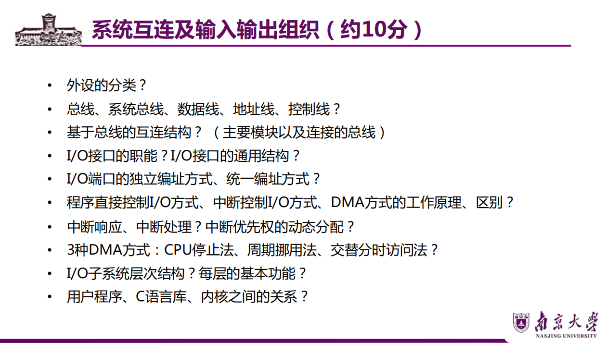

# 第八章 系统互连及输入输出组织


## 一、总线
### 1. 定义
总线是一组能为多个部分**分时共享**的公共信息传送线路，核心特点有2个：

- 分时：同一时刻仅允许一个部件向总线发送信息，多个部件需分时发送
- 共享：总线上可挂接多个部件，各部件通过该线路分时交换信息，多个部件可同时接收相同信息

【重点注意】：区分**数据通路**和**数据总线**  

- 数据总线：数据传输的媒介（物理线路）  
- 数据通路：各功能部件通过数据总线连接形成的实际数据传输路径（逻辑路径）

### 2. 总线核心参数
| 参数         | 说明                                                                 |
|--------------|----------------------------------------------------------------------|
| 总线宽度     | 数据总线的位数，反映一次能传送的数据位数                             |
| 总线工作频率 | 总线的时钟频率（单位：Hz）                                           |
| 总线带宽     | 数据传输速率，公式：**B = W×F/N**（B：带宽；W：总线宽度；F：工作频率；N：传输周期数） |
| 寻址能力     | 由地址总线位数决定，反映可访问的主存单元或I/O端口数量               |

### 3. 总线设备（系统总线分类）
#### （1）数据总线（DB）
- 功能：传输数据、指令、中断类型号等
- 传输方向：双向传输
- 核心特性：位数=总线宽度，决定单次数据传输量

#### （2）地址总线（AB）
- 功能：指出数据总线上源/目的数据所在的主存单元或I/O端口地址
- 传输方向：单向传输（从CPU指向主存/I/O设备）

#### （3）控制总线（CB）
- 功能：传输控制命令和定时信号，例如：
  - 请求/允许信号、中断请求/回答信号
  - 存储器读/写、I/O读/写控制信号

### 4. 总线结构（硬件互连关系）
```
CPU内部（寄存器组、ALU）→ CPU总线接口 → CPU（前端）总线 → 北桥芯片
                          ↓
                      南桥芯片
                          ↓
I/O总线 → 各类控制器/接口 → 外设
（如USB、以太网卡、磁盘控制器、PCI接口、声卡、视频卡等）
外设示例：鼠标器、键盘、网线、光驱、磁盘、显卡等
```

## 二、I/O接口
### 1. 核心功能
I/O接口是主机与外设的桥梁，解决主机与外设的速度匹配、格式转换等问题，核心职能4点：

- （1）数据缓冲：通过数据缓冲寄存器，匹配主机（高速）与外设（低速）的工作速度
- （2）错误/状态检测：通过状态寄存器保存设备状态（如是否就绪、是否出错），支持两类错误检测：
  - 设备故障/异常（硬件问题）
  - 数据传输错（通过校验码检测）
- （3）控制和定时：接收I/O总线的控制命令和定时信号，协调内部资源与外设的动作时序
- （4）数据格式转换：通过移位寄存器等部件实现串-并/并-串转换（如磁盘读写时的格式转换）

### 2. 通用结构
```
主机侧（I/O总线）          接口内部          设备侧（接口电缆）
数据线 → 数据缓冲寄存器 → 外设界面
地址线 → 地址译码和I/O控制逻辑 → 控制逻辑 → 外设界面
控制线 → 状态/控制寄存器 → 控制逻辑 → 外设界面
                                  ↓
                              数据/状态/控制信号交互
```

### 3. 编址方式（I/O端口的地址分配方式）
| 编址方式   | 定义                                                                 | 地址空间       | 访问指令       | 核心特点                     |
|------------|----------------------------------------------------------------------|----------------|----------------|------------------------------|
| 独立编址   | 对I/O端口单独编号，形成独立的I/O地址空间                             | 与主存地址空间分离 | 专门的I/O指令  | 需通过指令区分访问对象，地址无重叠 |
| 统一编址（存储器映射方式） | 从主存地址空间中划分部分地址给I/O端口，统一编号                     | 与主存地址空间统一 | 通用访存指令   | 按地址范围区分访问对象，无需专用I/O指令 |

【重点注意】：统一编址的本质是“将I/O端口映射到主存地址段”，因此可通过访存指令直接操作I/O端口。

## 三、I/O传输控制方式
### 1. 程序直接控制I/O（查询式I/O）
#### （1）无条件传送（同步）

- 原理：默认外设始终就绪，CPU直接执行I/O指令传输数据
- 适用场景：外设速度固定且已知（如简单LED灯、开关）
- 特点：控制简单，无需状态检测，但灵活性差

#### （2）条件传送（异步）

- 原理：CPU先查询外设状态寄存器，确认外设就绪后再执行I/O传输
- 流程：查询状态 → 就绪则传输 → 未就绪则重复查询
- 特点：需额外状态检测步骤，CPU利用率低（查询期间CPU空闲）

### 2. 中断控制I/O（重点考点）
#### 核心思想
CPU与外设并行工作：CPU执行主程序时，外设准备数据；外设就绪后发中断请求，CPU暂停主程序，转去执行中断服务程序，完成数据传输后返回主程序。

#### 核心功能（中断系统必备能力）

1. 记录中断请求：通过中断请求寄存器保存各中断源的请求状态
2. 自动响应中断：CPU在每条指令执行完毕后检测中断请求
3. 自动判优：多个中断同时请求时，按优先级选择响应顺序
4. 保护断点和现场：保存被中断程序的PC（断点地址）、PSW、寄存器内容，确保后续能恢复执行
5. 中断屏蔽：通过屏蔽字实现多重中断嵌套，动态调整中断优先级


#### 中断优先级（响应优先级，硬件固定）
**不可屏蔽中断 > 内部异常 > 可屏蔽中断**  

- 内部异常：硬件故障 > 软件中断  
- 可屏蔽中断：DMA中断 > I/O设备中断  
- I/O设备中断：高速设备 > 低速设备；输入设备 > 输出设备；实时设备 > 普通设备  

【重点注意】：  

- 响应优先级：硬件线路/查询程序决定，不可动态改变  
- 处理优先级：可通过中断屏蔽技术动态调整（实现多重中断）

#### 中断请求类型
| 中断类型       | 传输线路 | 特点                                                                 | 适用场景               |
|----------------|----------|----------------------------------------------------------------------|------------------------|
| 可屏蔽中断     | INTR线   | 优先级最低，关中断模式下不响应，可通过屏蔽字屏蔽                     | 普通I/O设备中断        |
| 不可屏蔽中断   | NMI线    | 优先级最高，关中断模式下仍响应，不可屏蔽                             | 时钟中断、电源掉电等紧急事件 |


#### CPU响应中断的条件（3个）

1. 中断源有合法中断请求（中断请求寄存器对应位为1）  
2. CPU允许中断（开中断状态，异常和不可屏蔽中断不受此限制）  
3. 一条指令执行完毕（异常不受此限制）

#### 中断响应过程（硬件自动执行，称为“中断隐指令”）

1. 关中断：保护断点/现场期间禁止响应其他中断，避免信息丢失  
2. 保存断点：将PC（下一条指令地址）和PSW存入栈或专用寄存器  
   【注意】：异常的断点是当前指令地址（需重新执行），中断的断点是下一条指令地址  
3. 引出中断服务程序：通过中断向量表找到对应服务程序入口地址，送入PC  

#### 中断向量与中断向量表

- 中断向量：每个中断源的唯一类型号对应的中断服务程序入口地址  
- 中断向量表：集中存放系统所有中断向量的内存区域（核心作用：快速查找入口地址）


#### 多重中断（中断嵌套）

- 定义：执行低优先级中断服务程序时，可被高优先级中断请求打断，高优先级处理完毕后返回原服务程序  
- 实现条件：  
  1. 中断服务程序中提前设置开中断指令  
  2. 高优先级中断有权打断低优先级中断  
- 屏蔽字作用：每一位对应一个中断源，1=允许中断，0=屏蔽中断，可通过特权指令修改，动态调整处理优先级

### 3. DMA方式（直接存储器存取）
#### 核心思想
完全由硬件实现外设与主存之间的成组数据传送，**数据不经过CPU**，降低CPU开销，CPU与外设并行工作。

#### 适用场景
磁盘、显卡、声卡、网卡等高速设备的大批量数据传送（硬件开销大）

#### 中断的作用
仅用于处理DMA传送故障或正常结束的通知（无需CPU参与数据传输）

#### DMA与CPU的访存协调方式（3种）
| 方式         | 原理                                                                 | 优点                     | 缺点                     |
|--------------|----------------------------------------------------------------------|--------------------------|--------------------------|
| 停止CPU访存  | DMA访存时，CPU完全停止访存，仅DMA使用主存                             | 控制简单，传输速率高     | CPU利用率低（DMA工作时CPU闲置） |
| 周期挪用     | I/O访存优先级高于CPU，DMA按需挪用一个主存周期，传送完立即释放总线       | 兼顾I/O传送与CPU效率     | 需频繁申请/归还总线控制权 |
| 交替访存     | 将CPU工作周期分为两个时间片，分别供CPU和DMA访存（适用于CPU周期>主存周期） | 无需总线控制权切换，速率高 | 硬件逻辑复杂             |

## 四、I/O子系统层次结构
### 1. 整体结构（从上到下）
```
用户空间I/O软件 → 内核空间I/O软件 → I/O硬件
```

- 用户空间I/O软件：提出I/O请求的用户程序（如调用C语言I/O库函数）  
- 内核空间I/O软件：分3层（与设备无关的I/O软件层 → 设备驱动程序层 → 中断服务程序层）  
- I/O硬件：具体外设及接口电路

### 2. 各层核心功能
| 层次               | 核心功能                                                                 |
|--------------------|--------------------------------------------------------------------------|
| 用户空间I/O软件    | 通过I/O函数（如C语言fread()、printf()）向内核发起I/O请求                 |
| 与设备无关的I/O软件 | 屏蔽设备差异，提供统一的I/O接口（如系统调用封装）                         |
| 设备驱动程序层     | 针对具体设备的控制逻辑，将内核指令转换为设备可识别的信号                 |
| 中断服务程序层     | 处理设备中断请求，完成数据传输的最终触发与状态反馈                       |
| I/O硬件            | 执行实际的I/O操作（如数据读写、信号转换）                               |

### 3. 用户程序、C语言库与内核的关系
以`printf()`函数为例，I/O请求的执行流程：  
```
用户程序（用户态）→ 调用printf()（C语言标准I/O库）→ 调用write()（封装函数）→ 触发write系统调用 → 切换到内核态 → 执行系统调用服务例程 → 控制I/O硬件完成输出
```
【重点注意】：用户程序无法直接操作I/O硬件，必须通过内核提供的系统调用间接实现（用户态→内核态切换）